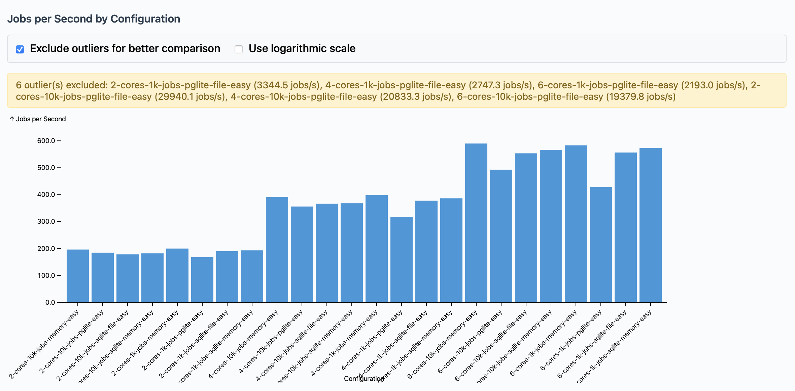

# @alcyone-labs/workalot

A high-performance, multi-threaded job queue system for NodeJS/BunJS. Achieves high jobs/sec throughput with linear scaling across CPU cores. Includes comprehensive job recovery, fault tolerance, and monitoring.

## Key Features

- **High performance** - Thousands of jobs/sec with optimized job distribution and worker orchestration
- **Linear scaling** - Scales across CPU cores (2→4→6→N cores) with significant performance improvements
- **Job recovery system** - Automatic recovery of stalled/crashed jobs with configurable timeouts and retry limits
- **Multiple backends** - In-memory, SQLite, PGLite, PostgreSQL with backend-specific optimizations
- **Fault tolerant** - Worker crash detection, job recovery, graceful error handling, and automatic cleanup
- **Developer-friendly** - Promise-based API, TypeScript support, dynamic job loading, job scheduling from within jobs
- **Real-time monitoring** - Detailed statistics, worker utilization, performance metrics, and job recovery tracking
- **Runtime flexibility** - Native BunJS and NodeJS support with TypeScript execution

## Quick Start

### Installation

```bash
npm install @alcyone-labs/workalot
# or
pnpm add @alcyone-labs/workalot
# or
deno add npm:@alcyone-labs/workalot
# or
yarn add @alcyone-labs/workalot
```

#### Optional Database Dependencies

For specific queue backends, install the corresponding database driver:

```bash
# For PGLite backend (PostgreSQL-compatible embedded database)
npm install @electric-sql/pglite

# For SQLite backend
# - Bun runtime: Uses built-in bun:sqlite (no installation needed)
# - Node.js runtime: Requires better-sqlite3
npm install better-sqlite3  # Only needed for Node.js

# Memory backend requires no additional dependencies
```

### Basic Usage

#### Option 1: PGLite In-Memory (Recommended)

**PostgreSQL features with memory performance**

```typescript
import { initializeTaskManager, scheduleAndWait, whenFree, shutdown } from '@alcyone-labs/workalot';

// Initialize with PGLite in-memory backend
await initializeTaskManager({
  backend: 'pglite',
  databaseUrl: 'memory://',  // In-memory PostgreSQL-compatible database
  maxThreads: 4
});

// Schedule a job and wait for completion
const result = await scheduleAndWait({
  jobFile: 'jobs/ProcessDataJob.ts',
  jobPayload: { data: [1, 2, 3, 4, 5] },
  jobTimeout: 10000
});

console.log('Job completed:', result);

// Get notified when queue is free
whenFree(() => {
  console.log('All jobs completed!');
});

// Graceful shutdown
await shutdown();
```

**Why PGLite In-Memory?**
- **Full PostgreSQL compatibility** - SQL queries, transactions, notifications
- **Memory-level performance** - No disk I/O overhead
- **Advanced features** - Real-time job monitoring, complex analytics
- **No file dependencies** - Good for containers and serverless

#### Option 2: Pure Memory (Maximum Speed)

```typescript
// Initialize with memory backend for maximum speed
await initializeTaskManager({
  backend: 'memory',
  persistenceFile: 'queue-state.json',  // Optional JSON persistence
  maxThreads: 4
});
```

#### Option 3: PGLite File-Based (Full Persistence)

```typescript
// Initialize with file-based PGLite for full persistence
await initializeTaskManager({
  backend: 'pglite',
  databaseUrl: './data/queue.db',  // File-based database
  maxThreads: 4
});
```

#### Performance Comparison Chart (a bit busy)



## API Reference

### Main Functions

#### `initializeTaskManager(config?, projectRoot?)`

Initialize the task management system.

**Parameters:**
- `config` (optional): Configuration object
- `projectRoot` (optional): Project root directory

**Configuration Options:**
```typescript
interface QueueConfig {
  maxThreads?: number;                          // Default: CPU cores - 2
  maxInMemoryAge?: number;                      // Default: 24 hours (ms)
  persistenceFile?: string;                     // Default: 'queue-state.json' (memory backend only)
  healthCheckInterval?: number;                 // Default: 5000ms

  // Backend configuration
  backend?: 'memory' | 'sqlite' | 'pglite' | 'postgresql'; // Default: 'memory'
  databaseUrl?: string;                         // For SQLite/PGLite/PostgreSQL backends

  // Job recovery configuration
  jobRecovery?: {
    enabled?: boolean;                          // Default: true
    checkInterval?: number;                     // Default: 60000ms (1 minute)
    stalledTimeout?: number;                    // Default: 300000ms (5 minutes)
    maxRecoveryAttempts?: number;               // Default: 3
  };
}
```

#### `scheduleAndWait(jobPayload)`

Schedule a job and wait for it to complete. Returns a promise that resolves when **that specific job** completes.

**Important:** `scheduleAndWait()` follows FIFO (first-in-first-out) queue order. If you have 1,000 jobs already queued, your `scheduleAndWait()` job becomes job #1,001 and will execute after all previous jobs complete. The function waits for completion, but does not provide immediate execution.

**Parameters:**
```typescript
interface JobPayload {
  jobFile: string;                              // Path to job file
  jobPayload: Record<string, any>;              // Data to pass to job
  jobTimeout?: number;                          // Execution timeout (default: 5000ms)
}
```

**Returns:** `Promise<JobResult>`

```typescript
interface JobResult {
  results: Record<string, any>; // Job output
  executionTime: number;        // Time taken (ms)
  queueTime: number;            // Time in queue (ms)
}
```

**How it works:**
1. Calls `schedule()` internally to add your job to the queue
2. Waits for that specific job ID to complete (using event listeners)
3. Returns the result when your job finishes, regardless of other jobs
4. Properly handles timeouts, errors, and cleanup

#### `schedule(jobPayload)`

Schedule a job without waiting for completion (fire and forget).

**Returns:** `Promise<string>` - Job ID

#### `whenFree(callback)`

Register a callback to be called when the queue becomes free (no pending jobs).

**Parameters:**
- `callback`: Function to call when queue is free


### Utility Functions

- `getStatus()` - Get comprehensive system status including job recovery stats
- `isIdle()` - Check if system is idle (no pending jobs)
- `whenIdle(timeoutMs?)` - Wait for system to become idle
- `getQueueStats()` - Get detailed queue statistics
- `getWorkerStats()` - Get worker pool statistics
- `getJobsByStatus(status)` - Get jobs by their status
- `removeWhenFreeCallback(callback)` - Remove a whenFree callback
- `getTaskManager()` - Get the underlying TaskManager instance
- `isInitialized()` - Check if the system is initialized
- `shutdown()` - Graceful shutdown with job recovery cleanup

### Job Recovery Functions

- `recoverStalledJobs()` - Manually trigger recovery of stalled jobs
- `getJobRecoveryStats()` - Get detailed job recovery statistics

## Creating Jobs

Jobs are TypeScript/JavaScript classes that implement the `IJob` interface by extending `BaseJob`. This section covers everything you need to know about creating, structuring, and using jobs.

### Job File Requirements

#### File Extensions and Runtime Support

Workalot supports multiple file formats with automatic runtime detection:

```typescript
// Supported file extensions
'.ts'   // TypeScript - native support in BunJS/Deno, requires compilation for Node.js
'.js'   // JavaScript - standard Node.js/Bun/Deno support
'.mjs'  // ES Modules - explicit module format
```

**Runtime Behavior:**
- **BunJS**: Executes TypeScript files directly without compilation
- **Node.js**: Requires compilation to JavaScript first, then reference the compiled `.js` files
- **Deno**: Executes TypeScript files directly without compilation, but requires specific flags

#### File Path Resolution

Job file paths in `scheduleAndWait()` are resolved relative to your project root:

```typescript
// Relative paths (recommended)
await scheduleAndWait({
  jobFile: 'jobs/ProcessDataJob.ts',        // ./jobs/ProcessDataJob.ts
  jobFile: 'src/workers/EmailJob.ts',       // ./src/workers/EmailJob.ts
  jobFile: 'lib/tasks/ReportJob.ts',        // ./lib/tasks/ReportJob.ts
});

// Subdirectory paths work seamlessly
await scheduleAndWait({
  jobFile: 'modules/analytics/MetricsJob.ts',
  jobFile: 'services/notifications/SlackJob.ts'
});
```

**Path Resolution Rules:**
1. Paths are resolved relative to the project root (where you initialize TaskManager)
2. Use forward slashes `/` on all platforms (Windows, macOS, Linux)
3. File must be readable and accessible at runtime
4. Extension is validated (`.ts`, `.js`, `.mjs` only)

### Job Class Structure

#### Basic Job Template

```typescript
import { BaseJob, JobExecutionContext } from '@alcyone-labs/workalot';

export class MyJob extends BaseJob {
  constructor() {
    super('MyJob'); // Optional: custom job name
  }

  async run(payload: Record<string, any>, context: JobExecutionContext): Promise<Record<string, any>> {
    // 1. Validate input data
    this.validatePayload(payload, ['requiredField']);

    // 2. Process data
    const result = await this.processData(payload.data);

    // 3. Schedule follow-up jobs if needed
    if (payload.needsFollowUp) {
      const followUpJobId = await context.scheduleAndWait({
        jobFile: 'jobs/FollowUpJob.ts',
        jobPayload: { originalResult: result }
      });
      console.log('Scheduled follow-up job:', followUpJobId);
    }

    // 4. Return success response
    return this.createSuccessResult({ result });
  }

  private async processData(data: any): Promise<any> {
    // Your job logic here
    return data;
  }
}
```

### Scheduling Jobs from Within Jobs

Jobs can schedule other jobs using the `context` parameter provided to the `run()` method. This enables powerful workflow patterns:

```typescript
import { BaseJob, JobExecutionContext } from '@alcyone-labs/workalot';

export class WorkflowJob extends BaseJob {
  async run(payload: Record<string, any>, context: JobExecutionContext): Promise<Record<string, any>> {
    this.validatePayload(payload, ['workflowType']);

    // Schedule a job and wait for its completion
    const processingRequestId = await context.scheduleAndWait({
      jobFile: 'jobs/DataProcessorJob.ts',
      jobPayload: { data: payload.inputData }
    });

    // Schedule background jobs (fire-and-forget)
    const cleanupRequestId = context.schedule({
      jobFile: 'jobs/CleanupJob.ts',
      jobPayload: { workflowId: payload.id }
    });

    const notificationRequestId = context.schedule({
      jobFile: 'jobs/NotificationJob.ts',
      jobPayload: {
        message: 'Workflow completed',
        userId: payload.userId
      }
    });

    return this.createSuccessResult({
      workflowCompleted: true,
      scheduledJobs: {
        processing: processingRequestId,
        cleanup: cleanupRequestId,
        notification: notificationRequestId
      }
    });
  }
}
```

#### Scheduling API

- **`context.scheduleAndWait(jobPayload)`**: Schedule a job for execution after current job completes. Returns a request ID.
- **`context.schedule(jobPayload)`**: Schedule a job for fire-and-forget execution. Returns a request ID immediately.

Both functions accumulate scheduling requests during job execution and process them automatically after the job completes.

**Note**: The `context` parameter is optional for backward compatibility. Existing jobs without the context parameter will continue to work unchanged.

#### Required Implementation

Every job must:

1. **Extend `BaseJob`**: Provides essential functionality and helper methods
2. **Implement `run()` method**: Main job execution logic with optional context parameter
3. **Export the class**: Must be exportable for dynamic loading

```typescript
// Correct - extends BaseJob and implements run()
export class ValidJob extends BaseJob {
  async run(payload: Record<string, any>, context: JobExecutionContext): Promise<Record<string, any>> {
    return this.createSuccessResult({ status: 'completed' });
  }
}

// Incorrect - missing BaseJob extension
export class InvalidJob {
  async run(payload: Record<string, any>) {
    return { status: 'completed' };
  }
}
```

### Job Export Patterns

Workalot supports multiple export patterns for maximum flexibility:

#### Default Export (Recommended)

```typescript
import { BaseJob, JobExecutionContext } from '@alcyone-labs/workalot';

export default class ProcessDataJob extends BaseJob {
  async run(payload: Record<string, any>, context: JobExecutionContext) {
    return this.createSuccessResult({ processed: true });
  }
}
```

#### Named Export

```typescript
import { BaseJob, JobExecutionContext } from '@alcyone-labs/workalot';

export class ProcessDataJob extends BaseJob {
  async run(payload: Record<string, any>, context: JobExecutionContext) {
    return this.createSuccessResult({ processed: true });
  }
}
```

**Auto-Discovery Rules:**
1. **Default export**: Used if available and is a class
2. **Named export**: Searches for class names matching:
   - Exact filename: `ProcessDataJob.ts` → `ProcessDataJob`
   - Capitalized filename: `processDataJob.ts` → `ProcessDataJob`
   - With "Job" suffix: `processData.ts` → `ProcessDataJob`

### Job Payload and Validation

#### Input Validation

Use `validatePayload()` to ensure required fields are present:

```typescript
export class EmailJob extends BaseJob {
  async run(payload: Record<string, any>, context: JobExecutionContext) {
    // Validate required fields
    this.validatePayload(payload, ['to', 'subject', 'body']);

    const { to, subject, body, attachments } = payload;

    // Optional fields can be accessed safely
    const priority = payload.priority || 'normal';

    // Schedule follow-up notification if high priority
    if (priority === 'high') {
      const notificationRequestId = context.schedule({
        jobFile: 'jobs/NotificationJob.ts',
        jobPayload: {
          type: 'email_sent',
          emailId: 'email-123',
          recipient: to
        }
      });
    }

    // Process email sending...
    return this.createSuccessResult({
      emailId: 'email-123',
      sentAt: new Date().toISOString()
    });
  }
}
```

#### TypeScript Type Safety

For better type safety, define payload interfaces:

```typescript
interface EmailPayload {
  to: string;
  subject: string;
  body: string;
  attachments?: string[];
  priority?: 'low' | 'normal' | 'high';
}

export class EmailJob extends BaseJob {
  async run(payload: EmailPayload, context: JobExecutionContext): Promise<Record<string, any>> {
    this.validatePayload(payload, ['to', 'subject', 'body']);

    // TypeScript now provides full type checking
    const recipient = payload.to;
    const isHighPriority = payload.priority === 'high';

    // Schedule audit log for high priority emails
    if (isHighPriority) {
      context.schedule({
        jobFile: 'jobs/AuditLogJob.ts',
        jobPayload: {
          action: 'high_priority_email_sent',
          recipient,
          timestamp: new Date().toISOString()
        }
      });
    }

    return this.createSuccessResult({
      emailId: 'email-123',
      recipient,
      priority: payload.priority || 'normal'
    });
  }
}
```

### Job ID Generation

#### Default Behavior

By default, jobs generate monotonic, time-sortable ULID identifiers:

```typescript
// Default ID generation (ULID - monotonic, time-sortable)
export class DefaultJob extends BaseJob {
  // Uses inherited getJobId() method
  // ID = ULID (e.g., "01ARZ3NDEKTSV4RRFFQ69G5FAV")
}
```

#### Custom ID Generation

Override `getJobId()` for custom ID logic:

```typescript
export class CustomIdJob extends BaseJob {
  getJobId(payload?: Record<string, any>): string | undefined {
    if (!payload) return undefined;

    // Custom ID based on business logic
    if (payload.userId && payload.action) {
      return `${payload.userId}-${payload.action}-${Date.now()}`;
    }

    // Fall back to default behavior
    return super.getJobId(payload);
  }

  async run(payload: Record<string, any>, context: JobExecutionContext) {
    return this.createSuccessResult({ processed: true });
  }
}
```

**ID Generation Guidelines:**
- Return `undefined` for auto-generated UUIDs
- Return `string` for custom IDs
- Ensure IDs are unique to prevent job collisions
- Consider including timestamps for uniqueness

### Helper Methods

The `BaseJob` class provides several helper methods for common operations:

#### Success and Error Results

```typescript
export class DataProcessorJob extends BaseJob {
  async run(payload: Record<string, any>, context: JobExecutionContext) {
    try {
      const result = await this.processData(payload.data);

      // Schedule cleanup job after successful processing
      context.schedule({
        jobFile: 'jobs/CleanupJob.ts',
        jobPayload: {
          tempFiles: result.tempFiles,
          processedAt: new Date().toISOString()
        }
      });

      // Return success result
      return this.createSuccessResult({
        recordsProcessed: result.count,
        outputFile: result.filename,
        processingTime: result.duration
      });

    } catch (error) {
      // Return error result (optional - you can also throw)
      return this.createErrorResult(
        'Data processing failed',
        { originalError: error.message }
      );
    }
  }
}
```

#### Runtime Payload Validation

```typescript
export class ValidationExampleJob extends BaseJob {
  async run(payload: Record<string, any>, context: JobExecutionContext) {
    // Validate multiple required fields
    this.validatePayload(payload, ['userId', 'action', 'timestamp']);

    // Validate nested objects
    if (payload.config) {
      this.validatePayload(payload.config, ['apiKey', 'endpoint']);
    }

    // Custom validation logic
    if (payload.timestamp < Date.now() - 86400000) {
      throw new Error('Timestamp cannot be older than 24 hours');
    }

    return this.createSuccessResult({ validated: true });
  }
}
```

### Error Handling in Jobs

#### Throwing Errors

The recommended approach is to throw errors for failures:

```typescript
export class ErrorHandlingJob extends BaseJob {
  async run(payload: Record<string, any>, context: JobExecutionContext) {
    this.validatePayload(payload, ['operation']);

    if (payload.operation === 'invalid') {
      // Throw error - will be caught and handled by the system
      throw new Error('Invalid operation requested');
    }

    if (payload.timeout && payload.timeout < 1000) {
      // Throw with specific error types
      throw new Error('Timeout must be at least 1000ms');
    }

    return this.createSuccessResult({ status: 'completed' });
  }
}
```

#### Error Context and Debugging

```typescript
export class DebuggableJob extends BaseJob {
  async run(payload: Record<string, any>, context: JobExecutionContext) {
    try {
      // Risky operation
      const result = await this.performRiskyOperation(payload);
      return this.createSuccessResult(result);

    } catch (error) {
      // Add context to errors for better debugging
      const enhancedError = new Error(
        `Job failed during ${payload.operation}: ${error.message}`
      );
      enhancedError.cause = error;
      throw enhancedError;
    }
  }

  private async performRiskyOperation(payload: any) {
    // Simulate operation that might fail
    if (Math.random() < 0.1) {
      throw new Error('Random failure for testing');
    }
    return { success: true };
  }
}
```

### Complete Job Examples

#### Simple Processing Job

```typescript
import { BaseJob, JobExecutionContext } from '@alcyone-labs/workalot';

export class SimpleProcessorJob extends BaseJob {
  async run(payload: { items: string[] }, context: JobExecutionContext) {
    this.validatePayload(payload, ['items']);

    const processedItems = payload.items.map(item => ({
      original: item,
      processed: item.toUpperCase(),
      timestamp: new Date().toISOString()
    }));

    // Schedule notification job if processing large batch
    if (payload.items.length > 100) {
      context.schedule({
        jobFile: 'jobs/NotificationJob.ts',
        jobPayload: {
          message: `Processed ${payload.items.length} items`,
          type: 'batch_complete'
        }
      });
    }

    return this.createSuccessResult({
      totalItems: payload.items.length,
      processedItems
    });
  }
}
```

#### Complex Business Logic Job

```typescript
import { BaseJob, JobExecutionContext } from '@alcyone-labs/workalot';

interface ReportPayload {
  userId: string;
  reportType: 'daily' | 'weekly' | 'monthly';
  dateRange: {
    start: string;
    end: string;
  };
  includeCharts?: boolean;
}

export class ReportGeneratorJob extends BaseJob {
  constructor() {
    super('ReportGeneratorJob');
  }

  async run(payload: ReportPayload, context: JobExecutionContext): Promise<Record<string, any>> {
    // Validate required fields
    this.validatePayload(payload, ['userId', 'reportType', 'dateRange']);
    this.validateDateRange(payload.dateRange);

    console.log(`Generating ${payload.reportType} report for user ${payload.userId}`);

    try {
      // Simulate data collection
      const data = await this.collectData(payload);

      // Generate report
      const report = await this.generateReport(data, payload);

      // Optionally generate charts
      let charts = null;
      if (payload.includeCharts) {
        charts = await this.generateCharts(data);
      }

      // Schedule follow-up jobs
      const reportId = `report-${Date.now()}`;

      // Schedule email notification
      const emailRequestId = context.schedule({
        jobFile: 'jobs/EmailNotificationJob.ts',
        jobPayload: {
          userId: payload.userId,
          reportId,
          reportType: payload.reportType,
          downloadUrl: report.url
        }
      });

      // Schedule cleanup job for temporary files
      context.schedule({
        jobFile: 'jobs/CleanupJob.ts',
        jobPayload: {
          reportId,
          tempFiles: report.tempFiles,
          scheduleAfter: Date.now() + 24 * 60 * 60 * 1000 // 24 hours
        }
      });

      return this.createSuccessResult({
        reportId,
        reportType: payload.reportType,
        userId: payload.userId,
        generatedAt: new Date().toISOString(),
        dataPoints: data.length,
        reportSize: report.size,
        chartsIncluded: !!charts,
        downloadUrl: report.url
      });

    } catch (error) {
      console.error(`Report generation failed for user ${payload.userId}:`, error);
      throw new Error(`Report generation failed: ${error.message}`);
    }
  }

  private validateDateRange(dateRange: { start: string; end: string }) {
    const start = new Date(dateRange.start);
    const end = new Date(dateRange.end);

    if (isNaN(start.getTime()) || isNaN(end.getTime())) {
      throw new Error('Invalid date format in dateRange');
    }

    if (start >= end) {
      throw new Error('Start date must be before end date');
    }
  }

  private async collectData(payload: ReportPayload) {
    // Simulate data collection with processing time
    await new Promise(resolve => setTimeout(resolve, 500));

    // Return mock data based on report type
    const baseCount = payload.reportType === 'daily' ? 24 :
                     payload.reportType === 'weekly' ? 168 : 720;

    return Array.from({ length: baseCount }, (_, i) => ({
      timestamp: new Date(Date.now() - i * 3600000).toISOString(),
      value: Math.floor(Math.random() * 100)
    }));
  }

  private async generateReport(data: any[], payload: ReportPayload) {
    // Simulate report generation
    await new Promise(resolve => setTimeout(resolve, 300));

    return {
      size: `${Math.floor(data.length * 0.1)}KB`,
      url: `https://reports.example.com/report-${Date.now()}.pdf`
    };
  }

  private async generateCharts(data: any[]) {
    // Simulate chart generation
    await new Promise(resolve => setTimeout(resolve, 200));

    return {
      chartCount: 3,
      types: ['line', 'bar', 'pie']
    };
  }

  getJobId(payload?: ReportPayload): string | undefined {
    if (!payload) return undefined;

    // Create unique ID based on user and date range
    const content = `${payload.userId}-${payload.reportType}-${payload.dateRange.start}-${payload.dateRange.end}`;
    return require('crypto').createHash('sha1').update(content).digest('hex');
  }
}
```

### TypeScript vs JavaScript Jobs

#### TypeScript Jobs (Recommended)

TypeScript provides better development experience with type safety and IDE support:

```typescript
// jobs/TypedJob.ts
import { BaseJob, JobExecutionContext } from '@alcyone-labs/workalot';

interface MyJobPayload {
  userId: string;
  action: 'create' | 'update' | 'delete';
  data: Record<string, any>;
}

export class TypedJob extends BaseJob {
  async run(payload: MyJobPayload, context: JobExecutionContext): Promise<Record<string, any>> {
    // Full type checking and IntelliSense support
    this.validatePayload(payload, ['userId', 'action', 'data']);

    // TypeScript catches errors at compile time
    const isCreateAction = payload.action === 'create';

    // Schedule audit log for all actions
    context.schedule({
      jobFile: 'jobs/AuditLogJob.ts',
      jobPayload: {
        userId: payload.userId,
        action: payload.action,
        timestamp: new Date().toISOString(),
        data: payload.data
      }
    });

    return this.createSuccessResult({
      userId: payload.userId,
      actionPerformed: payload.action,
      success: true
    });
  }
}
```

**Usage with TypeScript:**
```typescript
// BunJS - Direct TypeScript execution
await scheduleAndWait({
  jobFile: 'jobs/TypedJob.ts',  // .ts extension works directly
  jobPayload: { userId: '123', action: 'create', data: {} }
});

// Node.js - Must compile first and reference compiled output
// 1. Compile: pnpm run build (or tsc, vite build, etc.)
// 2. Reference the compiled .js file in dist/ (or your tsconfig outDir)
await scheduleAndWait({
  jobFile: 'dist/jobs/TypedJob.js',  // Must point to compiled .js file
  jobPayload: { userId: '123', action: 'create', data: {} }
});
```

#### JavaScript Jobs

Plain JavaScript works seamlessly but without compile-time type checking:

```javascript
// jobs/PlainJob.js
const { BaseJob } = require('@alcyone-labs/workalot');

class PlainJob extends BaseJob {
  async run(payload, context) {
    this.validatePayload(payload, ['userId', 'action']);

    // No compile-time type checking
    const result = await this.processAction(payload.action);

    // Schedule follow-up job using context
    context.schedule({
      jobFile: 'jobs/LogJob.js',
      jobPayload: {
        userId: payload.userId,
        action: payload.action,
        result: result
      }
    });

    return this.createSuccessResult({
      userId: payload.userId,
      result: result
    });
  }

  async processAction(action) {
    // Simulate processing
    return { processed: true, action };
  }
}

module.exports = { PlainJob };
```

**Usage with JavaScript:**
```javascript
await taskManager.scheduleAndWait({
  jobFile: 'jobs/PlainJob.js',  // .js extension
  jobPayload: { userId: '123', action: 'process' }
});
```

### Job File Organization

#### Recommended Directory Structure

```
project-root/
├── jobs/                   # Job definitions
│   ├── data/               # Data processing jobs
│   │   ├── ProcessorJob.ts
│   │   └── ValidatorJob.ts
│   ├── notifications/      # Notification jobs
│   │   ├── EmailJob.ts
│   │   └── SlackJob.ts
│   └── reports/           # Report generation jobs
│       └── ReportJob.ts
├── src/                   # Application code
└── dist/                  # Compiled JavaScript (if needed)
```

#### Path Examples for Different Structures

```typescript
// Flat structure
await scheduleAndWait({ jobFile: 'jobs/EmailJob.ts' });

// Nested structure
await scheduleAndWait({ jobFile: 'jobs/notifications/EmailJob.ts' });
await scheduleAndWait({ jobFile: 'jobs/data/ProcessorJob.ts' });

// Mixed with source code
await scheduleAndWait({ jobFile: 'src/workers/BackgroundJob.ts' });

// Compiled JavaScript (Node.js only - after compilation)
await scheduleAndWait({ jobFile: 'dist/jobs/EmailJob.js' });
```

### Common Patterns and Practices

#### Job Naming Conventions

```typescript
// Good - Clear, descriptive names
export class UserRegistrationJob extends BaseJob { }
export class EmailNotificationJob extends BaseJob { }
export class DataBackupJob extends BaseJob { }

// Avoid - Generic or unclear names
export class Job extends BaseJob { }
export class ProcessJob extends BaseJob { }
export class Handler extends BaseJob { }
```

#### Payload Design Patterns

```typescript
// Good - Structured, validated payloads
interface EmailJobPayload {
  recipient: {
    email: string;
    name?: string;
  };
  message: {
    subject: string;
    body: string;
    template?: string;
  };
  options?: {
    priority: 'low' | 'normal' | 'high';
    sendAt?: string;
  };
}

// Avoid - Flat, unstructured payloads
interface BadPayload {
  email: string;
  subject: string;
  body: string;
  name: string;
  priority: string;
  sendAt: string;
}
```

#### Error Handling Patterns

```typescript
export class RobustJob extends BaseJob {
  async run(payload: Record<string, any>, context: JobExecutionContext) {
    try {
      // Validate early
      this.validatePayload(payload, ['operation']);

      // Process with detailed error context
      const result = await this.performOperation(payload);

      return this.createSuccessResult(result);

    } catch (error) {
      // Log for debugging
      console.error(`Job ${this.jobName} failed:`, {
        payload,
        error: error.message,
        stack: error.stack
      });

      // Re-throw with context
      throw new Error(`${this.jobName} failed: ${error.message}`);
    }
  }
}
```

### Troubleshooting Job Issues

#### Common Job Loading Errors

```typescript
// Error: "Job file not found"
await scheduleAndWait({
  jobFile: 'wrong/path/Job.ts'  // File doesn't exist
});

// Solution: Verify file path relative to project root
await scheduleAndWait({
  jobFile: 'jobs/MyJob.ts'  // Correct relative path
});

// Error: "Unsupported job file extension"
await scheduleAndWait({
  jobFile: 'jobs/MyJob.py'  // Python not supported
});

// Solution: Use supported extensions
await scheduleAndWait({
  jobFile: 'jobs/MyJob.ts'  // TypeScript
});
```

#### Job Class Export Issues

```typescript
// Error: "No valid job class found"
// Missing export
class MyJob extends BaseJob {
  async run(payload) { return {}; }
}

// Solution: Export the class
export class MyJob extends BaseJob {
  async run(payload, context) { return {}; }
}

// Alternative: Default export
export default class MyJob extends BaseJob {
  async run(payload, context) { return {}; }
}
```

#### Runtime Environment Issues

```bash
# BunJS - TypeScript works directly
bun run app.ts
# Job files: 'jobs/MyJob.ts'

# Node.js - Requires compilation
npm run build
node dist/app.js
# Job files: 'dist/jobs/MyJob.js'
```

## Queue Backends

### PGLite In-Memory

**The sweet spot: PostgreSQL features with memory performance**

```typescript
await initializeTaskManager({
  backend: 'pglite',
  databaseUrl: 'memory://',  // In-memory PostgreSQL-compatible database
  maxThreads: 4
});
```

**Key Benefits:**
- **Full SQL support** - Complex queries, joins, aggregations
- **Real-time notifications** - PostgreSQL LISTEN/NOTIFY for job updates
- **Memory performance** - No disk I/O, good for high-throughput
- **Zero dependencies** - No external database required
- **Container-friendly** - No persistent storage needed

### Memory Backend (Maximum Speed)

Pure in-memory queue with optional JSON persistence:

```typescript
await initializeTaskManager({
  backend: 'memory',
  persistenceFile: 'queue-state.json',  // Optional persistence
  maxInMemoryAge: 24 * 60 * 60 * 1000   // 24 hours retention
});
```

**Good for:** High throughput, temporary processing, simple use cases

### SQLite Backend

High-performance SQLite database with runtime-optimized drivers:

```typescript
// In-memory SQLite
await initializeTaskManager({
  backend: 'sqlite',
  databaseUrl: 'memory://',  // In-memory database
  maxThreads: 4
});

// File-based SQLite with persistence
await initializeTaskManager({
  backend: 'sqlite',
  databaseUrl: './data/queue.db',  // File-based database
  maxThreads: 4
});
```

**Key Benefits:**
- **Runtime-optimized** - Uses Bun's native SQLite when available, falls back to better-sqlite3 for Node.js
- **High performance** - Good throughput with both in-memory and file-based storage
- **SQL features** - Full SQLite support with indexes, transactions, and complex queries
- **Cross-platform** - Works seamlessly with Bun, Node.js, and Deno
- **Zero configuration** - Automatic driver selection and database setup

**Good for:** Many use cases, development, high-performance applications

### PGLite File-Based (Full Persistence)

PostgreSQL-compatible embedded database with file persistence:

```typescript
await initializeTaskManager({
  backend: 'pglite',
  databaseUrl: './data/queue.db',  // File-based database
  maxThreads: 4
});
```

**Good for:** Development, single-node deployments, full data persistence

### Backend Performance Comparison

Run comprehensive backend benchmarks:

```bash
# Test all backends with identical workloads
bun run examples/performance-test.ts --backends

# Or run both scaling and backend tests
bun run examples/performance-test.ts --all
```

**Job Recovery Performance:**
- **Recovery Detection**: < 1 minute (configurable check interval)
- **Recovery Processing**: < 100ms per stalled job
- **Zero Performance Impact**: Background monitoring with minimal overhead
- **Automatic Cleanup**: Failed jobs after max retry attempts

### Backend Selection Guide

```typescript
// For maximum throughput (temporary data)
{ backend: 'memory' }

// For high performance + SQL features (recommended)
{ backend: 'sqlite', databaseUrl: 'memory://' }

// For development with persistence
{ backend: 'sqlite', databaseUrl: './dev-queue.db' }

// For PostgreSQL compatibility
{ backend: 'pglite', databaseUrl: 'memory://' }

// For production with existing PostgreSQL
{ backend: 'postgresql', databaseUrl: process.env.DATABASE_URL }
```

## BunJS Support

This library has native BunJS support and can run TypeScript files directly:

```bash
# Run with Bun
bun run examples/sample-consumer/app.ts

# Or with Node.js
pnpm run build
node dist/examples/sample-consumer/app.js
```

## Advanced Usage

### Class-based API

For more control, use the class-based API:

```typescript
import { TaskManager } from '@alcyone-labs/workalot';

const taskManager = new TaskManager({
  backend: 'pglite',
  databaseUrl: 'memory://',
  maxThreads: 8
});

await taskManager.initialize();

// Use taskManager methods...
await taskManager.shutdown();
```

### Event Handling

```typescript
import { TaskManager } from '@alcyone-labs/workalot';

const taskManager = new TaskManager();

taskManager.on('job-completed', (jobId, result) => {
  console.log(`Job ${jobId} completed:`, result);
});

taskManager.on('job-failed', (jobId, error) => {
  console.log(`Job ${jobId} failed:`, error);
});

taskManager.on('queue-empty', () => {
  console.log('Queue is now empty');
});

taskManager.on('all-workers-busy', () => {
  console.log('All workers are currently busy');
});

taskManager.on('workers-available', () => {
  console.log('Workers are now available');
});
```

### Statistics and Monitoring

```typescript
// Get comprehensive status including job recovery
const status = await getStatus();
console.log('System status:', status);
// Output includes: { queue: {...}, workers: {...}, jobRecovery: { isRunning: true, totalJobsWithAttempts: 0, ... } }

// Get queue statistics
const queueStats = await getQueueStats();
console.log('Queue stats:', queueStats);

// Get detailed worker statistics with job distribution
const workerStats = await getWorkerStats();
console.log('Worker stats:', workerStats);
// Output: { total: 4, ready: 4, busy: 2, available: 2, distribution: [1250, 1245, 1255, 1250], totalJobsProcessed: 5000 }

// Get job recovery statistics
const recoveryStats = await getJobRecoveryStats();
console.log('Recovery stats:', recoveryStats);
// Output: { isRunning: true, totalJobsWithAttempts: 2, totalRecoveredJobs: 5, totalFailedJobs: 1 }
```

The monitoring system now includes:
- **`distribution`**: Array showing jobs processed per worker
- **`totalJobsProcessed`**: Total jobs completed across all workers
- **`jobRecovery`**: Real-time job recovery statistics and status
- **Real-time tracking** of worker utilization, load balancing, and fault tolerance

### Batch Processing Configuration

```typescript
import { setBatchConfig, getBatchConfig } from '@alcyone-labs/workalot';

// Configure batch processing
setBatchConfig(20, true); // 20 jobs per batch, enabled

// Get current configuration
const config = getBatchConfig();
console.log(config); // { batchSize: 20, enabled: true }
```

Batch processing provides:
- **Configurable batch sizes** (1-100 jobs per batch)
- **Reduced communication overhead** between workers and orchestrator
- **Maintained job isolation** and error handling
- **Foundation for high throughput** processing

### Architecture Strengths

- **Optimized job distribution** - No O(n) bottlenecks for consistent performance
- **Event-driven scheduling** - Immediate job processing without polling delays
- **Backend-specific optimizations** - Each backend uses optimal data structures
- **Real-time monitoring** - Precise worker utilization and job distribution tracking
- **Race condition prevention** - Atomic job claiming and status management
- **Intelligent throttling** - Prevents event loop overload while maximizing throughput
- **Fault tolerance** - Automatic job recovery, worker crash detection, and stalled job handling
- **Zero job loss** - Comprehensive recovery system ensures no jobs are lost due to failures

### Performance Tips

- **Use memory backend** for maximum throughput
- **Scale worker count** with CPU cores for linear performance gains, keep at least 2 workers for the system
- **Monitor worker utilization** - Target 90%+ for optimal efficiency
- **Batch job submission** for reduced overhead on large workloads, tweak batch sizes for optimal results
- **Configure job recovery** - Adjust check intervals and timeouts based on your job characteristics
- **Monitor recovery stats** - Track stalled jobs and recovery performance for optimization

See `benchmarks/` directory for detailed performance testing.

## Architecture

Workalot uses a multi-layered architecture designed for high performance, reliability, and fault tolerance:

```
┌─────────────────────────────────────────────────────────────┐
│                     API Layer                               │
│  ┌─────────────────┐  ┌─────────────────┐  ┌──────────────┐ │
│  │ TaskManager     │  │ Singleton       │  │ Functions    │ │
│  │ (Class)         │  │ Wrapper         │  │ (schedule)   │ │
│  └─────────────────┘  └─────────────────┘  └──────────────┘ │
└─────────────────────────────────────────────────────────────┘
                                │
┌─────────────────────────────────────────────────────────────┐
│                  Worker System                              │
│  ┌─────────────────┐  ┌─────────────────┐  ┌──────────────┐ │
│  │ JobScheduler    │  │ WorkerManager   │  │ Worker       │ │
│  │ (Coordination)  │  │ (Pool Mgmt)     │  │ Threads      │ │
│  └─────────────────┘  └─────────────────┘  └──────────────┘ │
└─────────────────────────────────────────────────────────────┘
                                │
┌─────────────────────────────────────────────────────────────┐
│                Recovery System                              │
│  ┌─────────────────┐  ┌─────────────────┐  ┌──────────────┐ │
│  │ JobRecovery     │  │ Stalled Job     │  │ Crash        │ │
│  │ Service         │  │ Detection       │  │ Detection    │ │
│  └─────────────────┘  └─────────────────┘  └──────────────┘ │
└─────────────────────────────────────────────────────────────┘
                                │
┌─────────────────────────────────────────────────────────────┐
│                   Queue System                              │
│  ┌─────────────────┐  ┌─────────────────┐  ┌──────────────┐ │
│  │ QueueManager    │  │ IQueueBackend   │  │ JSON         │ │
│  │ (In-memory)     │  │ (Interface)     │  │ Persistence  │ │
│  └─────────────────┘  └─────────────────┘  └──────────────┘ │
└─────────────────────────────────────────────────────────────┘
                                │
┌─────────────────────────────────────────────────────────────┐
│                    Job System                               │
│  ┌─────────────────┐  ┌─────────────────┐  ┌──────────────┐ │
│  │ JobLoader       │  │ JobExecutor     │  │ JobRegistry  │ │
│  │ (Dynamic Load)  │  │ (Execution)     │  │ (Discovery)  │ │
│  └─────────────────┘  └─────────────────┘  └──────────────┘ │
└─────────────────────────────────────────────────────────────┘
```

### Key Components

- **API Layer**: Promise-based interface with singleton pattern for convenience
- **Worker System**: Multi-threaded job processing with health monitoring and crash detection
- **Recovery System**: Automatic job recovery, stalled job detection, and fault tolerance
- **Queue System**: Pluggable backends (Memory, SQLite, PGLite, PostgreSQL) with recovery support
- **Job System**: Dynamic job loading with TypeScript support and job scheduling from within jobs

## Configuration

### Environment Variables

- `NODE_ENV=test` - Disables process signal handlers during testing
- `VITEST=true` - Alternative test environment detection
- `DATABASE_URL` - Automatically selects PostgreSQL backend when set

### Backend Selection

The library automatically selects the appropriate backend:

1. **Test Environment** (`NODE_ENV=test`): Uses in-memory PGLite
2. **DATABASE_URL Set**: Uses PostgreSQL backend
3. **Default**: Uses PGLite with file-based storage

### Performance Tuning

**Core Configuration**:
- **maxThreads**: Set based on your CPU cores and workload (default: CPU cores - 2)
  - **Recommendation**: Use all available cores for CPU-intensive jobs
  - **Scaling**: Linear performance improvement up to 6+ cores verified
- **maxInMemoryAge**: Adjust based on memory constraints (default: 24 hours)
- **healthCheckInterval**: Lower for faster failure detection (default: 5000ms)
- **jobTimeout**: Set appropriate timeouts for your jobs (default: 5000ms)

**Backend Selection** (Performance Impact):
- **`memory`**: **Fast** optional JSON persistence, good for high-throughput
- **`pglite`**: **Moderate** (database-limited), PostgreSQL compatibility, good for development or single-VM execution
- **`postgresql`**: **Full** features, good for persistence and complex queries

**Optimization Tips**:
- **Use memory backend** for maximum throughput
- **Scale worker count** with CPU cores for linear performance gains
- **Monitor worker utilization** - Target 90%+ efficiency
- **Batch job submission** for reduced overhead on large workloads

## Error Handling and Job Recovery

The library provides comprehensive error handling and automatic job recovery:

### Error Handling

```typescript
try {
  const result = await scheduleAndWait({
    jobFile: 'jobs/MyJob.ts',
    jobPayload: { data: 'test' },
    jobTimeout: 10000
  });
  console.log('Job completed:', result);
} catch (error) {
  if (error.message.includes('timed out')) {
    console.log('Job timed out after 10 seconds');
  } else if (error.message.includes('TaskManager is shutting down')) {
    console.log('System is shutting down');
  } else {
    console.log('Job failed:', error.message);
  }
}
```

### Job Recovery System

The job recovery system automatically handles worker crashes and stalled jobs:

```typescript
// Configure job recovery (optional - enabled by default)
await initializeTaskManager({
  backend: 'sqlite',
  databaseUrl: 'memory://',
  jobRecovery: {
    enabled: true,                    // Enable/disable recovery
    checkInterval: 60000,             // Check every minute
    stalledTimeout: 300000,           // 5 minutes = stalled
    maxRecoveryAttempts: 3            // Max retries before failing
  }
});

// Monitor recovery events
taskManager.on('jobs-recovered', (data) => {
  console.log(`Recovered ${data.count} stalled jobs`);
});

// Get recovery statistics
const recoveryStats = await getJobRecoveryStats();
console.log('Recovery stats:', recoveryStats);
```

**What the recovery system handles:**
- **Worker crashes** - Jobs are automatically recovered after timeout
- **Worker stalls** - Background monitoring detects and recovers stuck jobs
- **JobScheduler crashes** - Recovery service runs independently
- **Database locks** - Each backend uses optimal locking strategy
- **Infinite retries** - Max recovery attempts prevent endless loops

**Recovery guarantees:**
- **Zero job loss** - All jobs are either completed, failed with proper error handling, or automatically recovered
- **Configurable timeouts** - Adjust based on your job characteristics
- **Performance monitoring** - Track recovery performance and job failure patterns
- **Graceful degradation** - System continues operating even during recovery operations

## Understanding `scheduleAndWait()` Behavior

### Queue Order and Execution

`scheduleAndWait()` is **not** a priority queue - it follows strict FIFO (first-in-first-out) order:

```typescript
// If you have existing jobs in the queue:
await schedule({ jobFile: 'jobs/Job1.ts' }); // Position 1
await schedule({ jobFile: 'jobs/Job2.ts' }); // Position 2
await schedule({ jobFile: 'jobs/Job3.ts' }); // Position 3

// Your scheduleAndWait() job goes to the END of the queue:
const result = await scheduleAndWait({
  jobFile: 'jobs/UrgentJob.ts'  // Position 4 - waits for Jobs 1, 2, 3
});
```

### What "Now" Means

- **"Now"** = Wait for completion of your specific job
- **NOT** = Execute immediately or skip the queue
- **NOT** = Higher priority than other jobs

### Practical Example

```typescript
// Scenario: 1000 jobs already queued
console.log('Scheduling urgent job...');
const startTime = Date.now();

const result = await scheduleAndWait({
  jobFile: 'jobs/UrgentJob.ts',
  jobPayload: { urgent: true }
});

const waitTime = Date.now() - startTime;
console.log(`Job completed after ${waitTime}ms`);
// Will be ~1000 jobs × average job time + your job execution time
```

### When to Use `scheduleAndWait()`

**Good use cases:**
- Synchronous workflow where next step depends on job result
- Error handling where you need to know if the job succeeded

**Consider alternatives:**
- Fire-and-forget jobs → Use `schedule()`
- Batch processing → Use `schedule()` + `whenFree()`

## Good Practices

1. **Job Design**
   - Keep jobs focused and single-purpose
   - Validate input data early
   - Use appropriate timeouts
   - Handle errors gracefully

2. **Performance**
   - Configure worker count based on workload
   - Monitor queue statistics
   - Use appropriate job timeouts
   - Clean up old completed jobs

3. **Reliability**
   - Always call `shutdown()` for graceful cleanup
   - Handle job failures appropriately
   - Monitor worker health and job recovery statistics
   - Use persistence for important queues
   - Configure job recovery timeouts based on your job characteristics
   - Monitor recovery events for system health insights

4. **Testing**
   - Test jobs in isolation
   - Use in-memory backends for tests (`backend: 'sqlite', databaseUrl: 'memory://'`)
   - Clean up resources in test teardown
   - Use unique database URLs for parallel tests

5. **BunJS Usage**
   - Run TypeScript files directly with `bun run`
   - Use absolute paths for job files when running with Bun
   - Leverage Bun's native APIs when available

## Benchmarking

The library includes a comprehensive benchmark suite for performance testing and validation:

```bash
# Quick performance test (recommended)
pnpm run benchmark:easy

# Run all benchmarks with system info display
bun run benchmarks/run-benchmarks.ts

# Test scaling across different core counts
bun run benchmarks/run-benchmarks.ts --difficulty easy --configs 2-cores-10k-jobs-memory,4-cores-10k-jobs-memory,6-cores-10k-jobs-memory

# Run specific configurations
bun run benchmarks/run-benchmarks.ts --configs 2-cores-10k-jobs,4-cores-10k-jobs
```

**Features:**
- **Friendly CLI**: Clean progress bars, system information display
- **Difficulty Scaling**: Adjustable CPU workload (easy, normal, hard, extreme)
- **File Logging**: Detailed timestamped logs with structured JSON data
- **Performance Metrics**: Throughput, latency, resource utilization, scaling efficiency
- **Multiple Backends**: Test performance across memory, SQLite, PGLite, and PostgreSQL
- **Visual Analysis**: Charts to help with analysis of linear scaling and bottlenecks (benchmarks/visualize-results.html)

**Recent Benchmark Results** (M2 Max, 12 cores, easy difficulty):
- **Memory Backend**: 4,366 jobs/sec (6 cores), nearly linear scaling
- **Execution Speed**: Sub-second completion for 1,000 job batches in memory
- **Job Recovery**: < 100ms recovery time per stalled job with zero performance impact
- **Fault Tolerance**: 100% job recovery rate in crash simulation tests

See `benchmarks/README.md` for detailed documentation and `ROADMAP.md` for optimization targets.

## Examples & Getting Started

### Quick Start Example

```typescript
import { TaskManager } from '@alcyone-labs/workalot';

// Create a simple job
// File: jobs/HelloJob.ts
import { BaseJob, JobExecutionContext } from '@alcyone-labs/workalot';

export class HelloJob extends BaseJob {
  async run(payload: { name: string }, context: JobExecutionContext) {
    this.validatePayload(payload, ['name']);

    // Simulate some work
    await new Promise(resolve => setTimeout(resolve, 100));

    // Schedule a follow-up welcome email
    if (payload.name !== 'Test') {
      context.schedule({
        jobFile: 'jobs/WelcomeEmailJob.ts',
        jobPayload: {
          recipientName: payload.name,
          timestamp: new Date().toISOString()
        }
      });
    }

    return this.createSuccessResult({
      message: `Hello, ${payload.name}!`,
      timestamp: new Date().toISOString()
    });
  }
}

// Use the job
const taskManager = new TaskManager({
  backend: 'memory',
  maxThreads: 4
});

await taskManager.initialize();

// Schedule and wait for job completion
const result = await taskManager.scheduleAndWait({
  jobFile: 'jobs/HelloJob.ts',
  jobPayload: { name: 'World' }
});

console.log(result.results.message); // "Hello, World!"

await taskManager.shutdown();
```

### Complete Examples

See the `examples/` directory for comprehensive examples:

- **`examples/quick-start.ts`** - Quick start guide with multiple examples
- **`examples/pglite-inmemory.ts`** - PGLite in-memory features and performance comparison
- **`examples/basic-usage.ts`** - Simple API usage and job creation
- **`examples/sample-consumer/`** - Complete application with multiple job types
- **`examples/performance-test.ts`** - Performance testing and backend benchmarking
- **`examples/error-handling.ts`** - Comprehensive error handling patterns

#### Try the PGLite In-Memory Example

```bash
# Run the dedicated PGLite in-memory example
bun run examples/pglite-inmemory.ts

# Compare performance across backends
bun run examples/performance-test.ts --backends
```

### Common Use Cases

#### High-Throughput Data Processing
```typescript
// Process large datasets efficiently
for (let i = 0; i < 10000; i++) {
  taskManager.schedule({
    jobFile: 'jobs/DataProcessorJob.ts',
    jobPayload: { batchId: i, data: largeBatch[i] }
  });
}

// Wait for all jobs to complete
await taskManager.whenIdle();
```

#### Background Task Processing
```typescript
// Fire-and-forget background tasks
const jobId = await taskManager.schedule({
  jobFile: 'jobs/EmailSenderJob.ts',
  jobPayload: {
    to: 'user@example.com',
    template: 'welcome',
    data: { username: 'john' }
  }
});

console.log(`Email job scheduled: ${jobId}`);
```

#### Real-time Monitoring
```typescript
// Monitor system performance and job recovery
taskManager.on('job-completed', (jobId, result) => {
  console.log(`Job ${jobId} completed in ${result.executionTime}ms`);
});

taskManager.on('jobs-recovered', (data) => {
  console.log(`Recovered ${data.count} stalled jobs`);
});

setInterval(async () => {
  const stats = await taskManager.getStatus();
  console.log(`Queue: ${stats.queue.pending} pending, ${stats.queue.processing} processing`);
  console.log(`Recovery: ${stats.jobRecovery.totalJobsWithAttempts} jobs with recovery attempts`);
}, 1000);
```

## Dependencies

### Core Dependencies
- **ulidx**: ULID generation for unique job IDs

### Optional Dependencies
- **@electric-sql/pglite**: PostgreSQL-compatible embedded database (for PGLite backend)
- **better-sqlite3**: High-performance SQLite driver (for SQLite backend on Node.js)

**Runtime-Specific SQLite Support:**
- **Bun runtime**: Uses built-in `bun:sqlite` (no additional installation required)
- **Node.js runtime**: Requires `better-sqlite3` package

The library automatically detects the runtime and uses the optimal SQLite driver. Install only the dependencies you need for your chosen backend and runtime.

## Requirements

- **Node.js**: >= 18.0.0
- **BunJS**: >= 1.2.0 (optional, for native TypeScript support)
- **Deno**: >= 2

## License

MIT

## Contributing

1. Fork the repository
2. Create a feature branch
3. Add tests for new functionality
4. Ensure all tests pass with `pnpm test`
5. Follow project conventions (no emojis, use PNPM)
6. Submit a pull request

## Roadmap

### Current Status: V1 Ready

Workalot has achieved good performance with significant improvement and linear scaling. The library includes comprehensive features including automatic job recovery, fault tolerance, and zero job loss guarantees.

### Upcoming Features

**Database Backend Enhancement**
- PGLite backend optimization for 1,000+ jobs/sec with database persistence
- PostgreSQL production features with connection pooling and batch operations
- Database-specific optimizations for high-throughput scenarios
- Multi-tenant support with isolated job queues per namespace

**Advanced Queue Management**
- Dynamic queue sizing based on job complexity and worker performance
- Auto-scaling worker queues during peak load periods
- Enhanced monitoring with real-time queue depth and job latency tracking
- Advanced error handling with automatic retry and dead letter queues

**Performance Optimizations**
- Object pooling for job context containers to reduce GC pressure
- Binary serialization to replace JSON for faster worker communication
- Memory-mapped job queues for low latency job distribution
- Dynamic worker scaling based on system load and queue depth

**Advanced Features**
- Horizontal scaling with multi-node orchestrator and job distribution
- Advanced analytics with performance dashboards and monitoring
- Job prioritization with database-level priority queues
- Comprehensive backup and recovery procedures for production deployments
