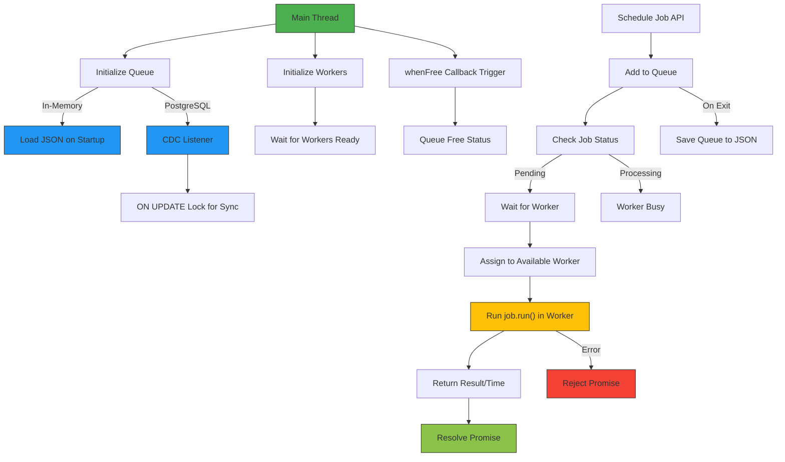

A multi-thread NodeJS / BunJS library that does the following:

1. Queue Management
    1. Has an in-memory item queue. This queue is managed by the main thread, before onServerExit, it should save its content to a JSON file, it should load it on start up. Each record should maintain the status of whether a job is being worked on ATM or not or has been completed already, the time it was requested to be scheduled. We can remove the records from memory when they are done to not create too much memory pressure.
    2. The queue management should be swappable with in-database management, in particular via PostgreSQL table with CDC listener and ON UPDATE lock for optimal performance.
    3. Fields
        1. `lastUpdated`
        2. `status: pending | processing | completed | failed`
    4. Config
        1. `maxInMemoryAge` in milliseconds
2. Jobs
    1. Has a flat job definition whereby the `jobFile` field of of the payload points to the task file name under project root, `jobPayload` is an arbitrary, serializable JSON payload that is forwarded to the job
    2. Each job has a method `getJobId` that returns its own ID, each task will compute its own ID, that way it can integrate entropy knowing its own parameters
    3. Each job also has a method `run` that will take its own payload and will compute its task, and return a result that’s an arbitrary JSON result
    4. Fields
        1. `jobFile: string | PathLike`
        2. `jobPayload: Object`
        3. `jobTimeout: number | undefined` // Default to 5000ms execution time
    5. Returns
        1. `results: Object`
    6. Job methods
        1. `getJobId(): string | undefined` // If undefined, the queue manager will generate a unique ID (e.g., a ULID via `ULIDx` package). If a collision occurs with an existing record, the scheduling will throw an error and the promise will reject.
            1. Typically, the task will return a SHA1 of the concatenated parameters + task name.
        2. `run(): Object | undefined` // It will throw if an error happens, the throw must be forwarded when rejecting the promise returned by the `scheduleNow` API. Otherwise the result must be returned as-is when resolving the promise returned by the `scheduleNow` API.
3. Multi-threaded job distribution
    1. The main thread will initialize the library, load the environment settings and determine how many threads should be initialized
    2. It will initialize the threads, wait for each of them to be ready
    3. Then anytime a new job comes in via Queue Management, it will distribute it to an available worker, until the response + result is received, and continue at infinitum
    4. When no jobs are being distributed, run a health check ping every 5000ms. The ping runs a simple “ping” task and expects a “pong” back from the run results.
    5. Config
        1. `maxThreads: number | undefined` // If undefined, set to `os.cpus().length - 2`, if negative, set to `os.cpus().length + maxThreads`
4. Exposed APIs
    1. When the consumer wants to schedule a job, it imports the library singleton, which should instantiate the queue and threads if not done yet, then the exposed APIs become available
    2. APIs
        1. `whenFree` method takes a callback that will be triggered when the queue becomes free, meaning that at least one worker has no job to do
        2. `scheduleNow` method takes a `payload` property that is a JSON payload with `jobFile` and `jobPayload` fields, schedules it, it returns a promise that that forwards the `results` payload from the job execution, including how long it took to execute and how long it waited in queue, and throws via .catch() with the fail error details, when the job failed so the caller can react to it by re-scheduling it or simply dropping the job or leaving the execution loop.
            1. Returns a promise
                1. `then` returns
                    1. `results` payload from the job `run()`
                2. `catch()` returns
                    1. Error from loading job file such as file not found, file does not have required APIs (getJobId, run), etc…
                    2. Error from running the job `run` method
                    3. Any other error related to the scheduling of this job

## Stack

- NodeJS workers, BunJS compatible
- PNPM for package management
- Vitest for testing
- In-memory job queue (but should be abstracted enough that we can add plugins such as PGSQL based queue management)
- Multi-threaded, with strong error handling, keeping enough CPU cores available for the system
- File-based task definition for flexible job expansion
- Promise-based exposed API execution so it’s easy to consume, orchestrator handles the “job scheduling to promise“ piping
- Enough tests to make sure this works properly

